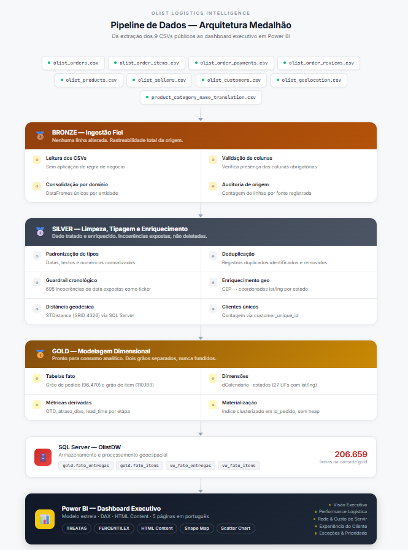
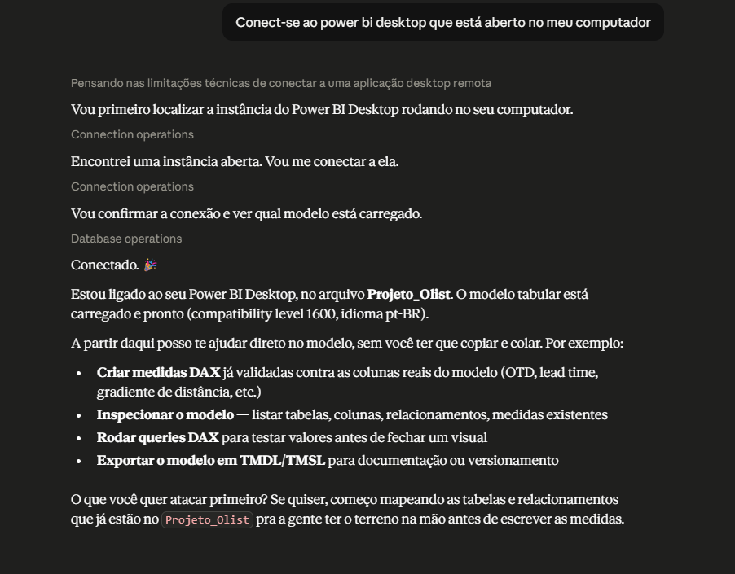
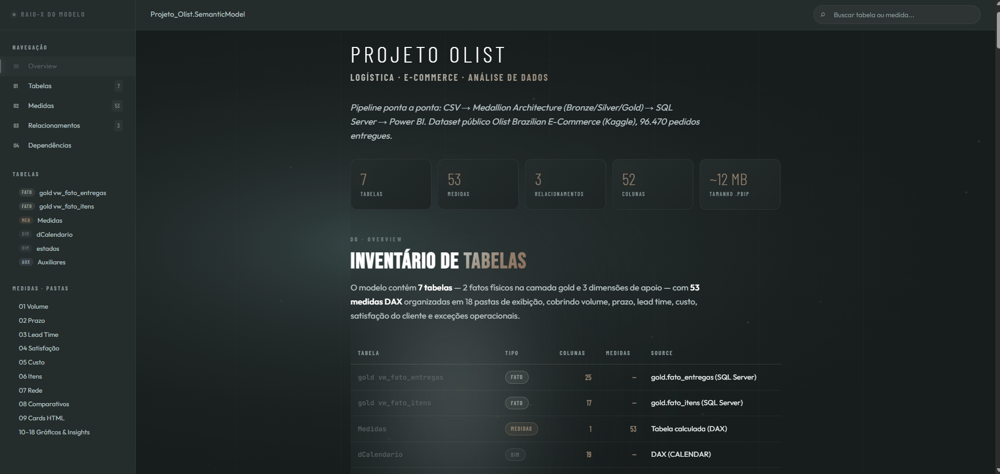

<h1 align="center">📦 Olist Logistics Intelligence — Documentação Técnica</h1>

<p align="center">
  <em>Pipeline analítico de ponta a ponta sobre a operação logística da Olist</em><br>
  <strong>Python (ETL) → SQL Server (modelagem geoespacial) → Power BI (visualização)</strong>
</p>

<p align="center">
  
  
  
  
  
</p>

> Este é o documento técnico aprofundado. Para a visão executiva e as descobertas de negócio, consulte o [`README.md`](./README.md).

---

## 📑 Índice

1. [Contexto e objetivo](#1-contexto-e-objetivo)
2. [Arquitetura da solução](#2-arquitetura-da-solução)
3. [Camada de extração e transformação (Python)](#3-camada-de-extração-e-transformação-python)
   - [3.1 A arquitetura Medalhão na prática](#31-a-arquitetura-medalhão-na-prática)
   - [3.2 Bronze — ingestão fiel](#32-bronze--ingestão-fiel)
   - [3.3 Silver — limpeza, tipagem e enriquecimento geoespacial](#33-silver--limpeza-tipagem-e-enriquecimento-geoespacial)
   - [3.4 O guardrail cronológico — governança que não se esconde](#34-o-guardrail-cronológico--governança-que-não-se-esconde)
   - [3.5 Carga da Silver no SQL Server](#35-carga-da-silver-no-sql-server)
4. [Modelagem no SQL Server](#4-modelagem-no-sql-server)
   - [4.1 As tabelas Gold e a escolha de cada tipo](#41-as-tabelas-gold-e-a-escolha-de-cada-tipo)
   - [4.2 O cálculo geoespacial no banco (STDistance)](#42-o-cálculo-geoespacial-no-banco-stdistance)
   - [4.3 As views — regra de negócio no banco](#43-as-views--regra-de-negócio-no-banco)
   - [4.4 O modelo de dados (Star Schema de dois grãos)](#44-o-modelo-de-dados-star-schema-de-dois-grãos)
5. [Do dado à decisão — o dashboard](#5-do-dado-à-decisão--o-dashboard)
   - [5.1 Como os indicadores são construídos](#51-como-os-indicadores-são-construídos)
   - [5.2 O relacionamento virtual entre grãos (TREATAS)](#52-o-relacionamento-virtual-entre-grãos-treatas)
   - [5.3 As 5 páginas e seus desafios técnicos](#53-as-5-páginas-e-seus-desafios-técnicos)
6. [IA como copiloto técnico — MCP + Claude](#6-ia-como-copiloto-técnico--mcp--claude)
   - [6.1 O que é o MCP e como foi integrado](#61-o-que-é-o-mcp-e-como-foi-integrado)
   - [6.2 Fluxo de trabalho com o modelo vivo](#62-fluxo-de-trabalho-com-o-modelo-vivo)
   - [6.3 Patterns DAX desenvolvidos via MCP](#63-patterns-dax-desenvolvidos-via-mcp)
   - [6.4 Documentação automática do modelo](#64-documentação-automática-do-modelo)
   - [6.5 O que esse fluxo demonstra profissionalmente](#65-o-que-esse-fluxo-demonstra-profissionalmente)
7. [Principais insights e achados de governança](#7-principais-insights-e-achados-de-governança)
   - [7.1 O que os dados revelaram sobre o negócio](#71-o-que-os-dados-revelaram-sobre-o-negócio)
   - [7.2 Achados de governança e qualidade](#72-achados-de-governança-e-qualidade)
   - [7.3 Conclusão](#73-conclusão)

---

## 1. Contexto e objetivo

Operações de e-commerce vivem ou morrem pela **promessa de entrega**. Um atraso não é apenas um KPI vermelho: é a origem mensurável de detratores, churn e erosão de reputação. Este projeto disseca a operação logística da Olist para responder, com rigor estatístico, a uma pergunta que todo Head de Operações faz:

> **Onde exatamente perdemos o cliente, e qual é o menor conjunto de ações que recupera o maior volume de valor?**

A resposta não é "entregar mais rápido em todo lugar". É cirúrgica: identificar limiares de tolerância, zonas críticas de rede e exceções de alto impacto onde a intervenção paga por si mesma.

Uma vez montada a estrutura — dado limpo, modelo relacionado e medidas confiáveis — o mesmo painel passa a responder dezenas de outras perguntas conforme surgem, sem refazer nada. É a diferença entre montar um relatório pontual e construir uma **base analítica reutilizável**.

### Objetivo

Construir um dashboard para tomada de decisão, da extração do CSV bruto até a visualização interativa, demonstrando domínio sobre todo o ciclo de vida do dado: engenharia em arquitetura Medalhão, modelagem dimensional com componente geoespacial, governança e visualização.

### Escopo dos dados

| Item | Detalhe |
|------|---------|
| **Fonte** | [Brazilian E-Commerce Public Dataset by Olist](https://www.kaggle.com/datasets/olistbr/brazilian-ecommerce) (Kaggle) |
| **Arquivos brutos** | 9 CSVs relacionais (pedidos, itens, produtos, vendedores, clientes, pagamentos, avaliações, geolocalização, tradução de categorias) |
| **Período analisado** | Setembro/2016 a Agosto/2018 |
| **Grão de pedido** | 96.470 pedidos entregues (`gold.fato_entregas`) |
| **Grão de item** | 110.189 itens (`gold.fato_itens`) |
| **Clientes únicos** | 93.350 (via `customer_unique_id`) |
| **Cobertura geoespacial** | 99,51% dos itens com distância calculada |

---

## 2. Arquitetura da solução

O projeto segue a **Arquitetura Medalhão** (Bronze, Silver, Gold), com separação clara de responsabilidades. Cada ferramenta faz aquilo que faz de melhor, sob um princípio norteador: **ferramenta proporcional ao dado**.



A **extração** parte de 9 CSVs relacionais que, sozinhos, não respondem nada: são tabelas soltas de um banco transacional. A camada **Bronze** os ingere fielmente, sem aplicar regra de negócio. A camada **Silver** é onde o dado ganha forma: tipos são padronizados, duplicatas removidas, as incoerências cronológicas detectadas e, o passo mais caro, o enriquecimento geoespacial que transforma pares de coordenadas em distância real. A camada **Gold** modela dimensionalmente o resultado em duas tabelas fato de grãos distintos, materializadas com índice para eliminar operadores de bloqueio. O **SQL Server** persiste e serve, com views que centralizam a regra de negócio. O **Power BI** consome dado pronto, aplicando apenas a camada semântica em DAX e a apresentação.

### A decisão estrutural: por que Medalhão

O dado bruto nunca deve entrar contaminado na camada de consumo. Cada camada tem um contrato claro:

> A camada Bronze preserva a origem. A Silver corrige e enriquece. A Gold modela para consumo. Quem consulta a Gold pode confiar que os tipos estão certos, as coordenadas viraram distância e as anomalias estão sinalizadas, não escondidas.

---

## 3. Camada de extração e transformação (Python)

### 3.1 A arquitetura Medalhão na prática

A separação em dois grãos foi a decisão de modelagem mais importante. O **grão de pedido** (`fato_entregas`) contém tudo que acontece uma vez por pedido: datas, prazo, nota. O **grão de item** (`fato_itens`) contém tudo que varia dentro de um pedido: produto, frete, peso, categoria, vendedor e distância.

| Camada | Script | Responsabilidade |
|--------|--------|------------------|
| Bronze + Silver | `olist_pipeline_bronze_silver.py` | Lê os 9 CSVs (`dtype=str`), salva Bronze como Parquet, aplica tipagem/limpeza/deduplicação geo e salva Silver como Parquet |
| Carga Silver → SQL | `olist_carga_silver_sqlserver.py` | Lê os Parquets da Silver e carrega nas tabelas `silver.*` do OlistDW via TRUNCATE + INSERT idempotente |
| Gold (views) | `olist_02_schema_sqlserver.sql` | Cria as views `gold.vw_fato_entregas` e `gold.vw_fato_itens` direto no banco, onde vivem as regras de negócio |

### 3.2 Bronze — ingestão fiel

```python
"""
PROJETO OLIST - PIPELINE DE DADOS  |  Camada Bronze
Ingestao crua dos CSVs, sem tratamento (fonte da verdade).
Salva cada tabela como Parquet na pasta /bronze.
"""
from pathlib import Path
import pandas as pd

BASE   = Path(r"C:\...\PROJETO OLIST")
BRONZE = BASE / "bronze"
BRONZE.mkdir(exist_ok=True)

ARQUIVOS = {
    "olist_customers_dataset.csv":            "customers",
    "olist_geolocation_dataset.csv":          "geolocation",
    "olist_order_items_dataset.csv":          "order_items",
    "olist_order_payments_dataset.csv":       "order_payments",
    "olist_order_reviews_dataset.csv":        "order_reviews",
    "olist_orders_dataset.csv":               "orders",
    "olist_products_dataset.csv":             "products",
    "olist_sellers_dataset.csv":              "sellers",
    "product_category_name_translation.csv":  "category_translation",
}

bronze = {}
for arquivo, nome in ARQUIVOS.items():
    caminho = BASE / arquivo
    if not caminho.exists():
        print(f"  [ATENÇÃO] não encontrado: {arquivo} -- pulando")
        continue
    df = pd.read_csv(caminho, dtype=str, encoding="utf-8")
    df.to_parquet(BRONZE / f"{nome}.parquet", index=False)
    bronze[nome] = df
    print(f"  {nome:<22} {len(df):>8,} linhas")
```

**Por que `dtype=str` em tudo.** A Bronze é a camada de fidelidade: o dado deve entrar exatamente como está no arquivo, sem que o pandas tente adivinhar tipos. Com `dtype=str`, tudo chega como texto e a tipagem correta fica para a Silver.

**Por que Parquet e não CSV.** O Parquet é colunar, comprime bem e carrega muito mais rápido que CSV. Como a Bronze roda uma única vez por atualização e a Silver a lê potencialmente várias vezes durante desenvolvimento, a economia de I/O justifica o formato.

### 3.3 Silver — limpeza, tipagem e enriquecimento geoespacial

```python
def parse_datetime(serie: pd.Series) -> pd.Series:
    """Converte texto em datetime de forma robusta.
    Se o arquivo tiver passado pelo Excel-BR e virado dd/mm/aaaa,
    refazemos com dayfirst=True. Erros viram NaT.
    """
    convertido = pd.to_datetime(serie, errors="coerce")
    if convertido.isna().mean() > 0.5:
        convertido = pd.to_datetime(serie, errors="coerce", dayfirst=True)
    return convertido

def prata_geolocation(df):
    """Corrige lat/lng, valida faixa do Brasil e DEDUPLICA por prefixo de CEP."""
    df["geolocation_lat"] = pd.to_numeric(df["geolocation_lat"], errors="coerce")
    df["geolocation_lng"] = pd.to_numeric(df["geolocation_lng"], errors="coerce")
    faixa_ok = (
        df["geolocation_lat"].between(-34, 6) &
        df["geolocation_lng"].between(-74, -33)
    )
    df = df[faixa_ok].copy()
    geo = (
        df.groupby("geolocation_zip_code_prefix", as_index=False)
          .agg(geolocation_lat=("geolocation_lat",   "median"),
               geolocation_lng=("geolocation_lng",   "median"),
               geolocation_city=("geolocation_city", "first"),
               geolocation_state=("geolocation_state","first"))
    )
    return geo
```

**Por que uma função por tabela.** Cada tabela tem suas próprias peculiaridades. Uma função por tabela torna cada transformação explícita, testável isoladamente e fácil de ajustar sem risco de quebrar as outras.

**Por que deduplicar geolocalização pela mediana.** O dataset original tem múltiplas linhas por prefixo de CEP. Para usar o CEP como chave de JOIN nas views, preciso de uma única coordenada por prefixo. A mediana é mais robusta que a média contra outliers geográficos.

### 3.4 O guardrail cronológico — governança que não se esconde

```python
# Auditoria de coerência cronológica — a física do processo foi respeitada?
inc_postagem  = orders["order_delivered_carrier_date"]  < orders["order_approved_at"]
inc_entrega   = orders["order_delivered_customer_date"] < orders["order_delivered_carrier_date"]
inc_aprovacao = orders["order_approved_at"]             < orders["order_purchase_timestamp"]

print(f"Postagem antes da aprovação: {inc_postagem.sum()}")    # 675
print(f"Entrega antes da postagem:   {inc_entrega.sum()}")      # 20
print(f"Aprovação antes da compra:   {inc_aprovacao.sum()}")    # 14
```

O resultado foram **695 incoerências**. A decisão foi **não deletar** — convertê-los num guardrail visível, um ticker de qualidade exibido na Página 2 do painel.

**A pergunta seguinte foi crítica: esses 695 contaminam os percentis?**

```python
limpo = orders[
    (orders["order_delivered_carrier_date"]  >= orders["order_approved_at"]) &
    (orders["order_delivered_customer_date"] >= orders["order_delivered_carrier_date"])
]
print("P90 completo:", orders["lead_time_total_dias"].quantile(0.90))  # 23
print("P90 limpo:   ", limpo["lead_time_total_dias"].quantile(0.90))   # 23
print("P95 completo:", orders["lead_time_total_dias"].quantile(0.95))  # 29
print("P95 limpo:   ", limpo["lead_time_total_dias"].quantile(0.95))   # 29
```

Valores **idênticos**. O ruído fica confinado à cascata de etapas intermediárias, não ao lead time total.

### 3.5 Carga da Silver no SQL Server

```python
with engine.begin() as conn:
    for nome in TABELAS:
        df = pd.read_parquet(SILVER / f"{nome}.parquet")
        conn.exec_driver_sql(f"TRUNCATE TABLE silver.{nome};")
        df.to_sql(
            name=nome, con=conn, schema="silver",
            if_exists="append", index=False, chunksize=1000,
        )
```

**Por que `fast_executemany=True`.** Agrupa linhas e faz muito menos round-trips para o banco. Em 110 mil itens, a diferença é de minutos para segundos.

**Por que `TRUNCATE` e não `DELETE`.** O `TRUNCATE` zera a tabela de forma atômica e muito mais rápida, sem gerar log de transação por linha. Como a recarga é sempre total a partir do Parquet, não há risco de perda de dado.

---

## 4. Modelagem no SQL Server

### 4.1 As tabelas Gold e a escolha de cada tipo

```sql
CREATE TABLE gold.fato_entregas (
    id_pedido              VARCHAR(32)   NOT NULL,
    status_pedido          VARCHAR(20)   NOT NULL,
    id_cliente_unico       VARCHAR(32)   NOT NULL,
    estado_cliente         CHAR(2)       NOT NULL,
    data_compra            DATETIME      NOT NULL,
    lead_time_total_dias   INT,
    atraso_dias            INT,
    flag_no_prazo          TINYINT,
    nota_avaliacao         DECIMAL(4,2),
    -- ...
    CONSTRAINT PK_fato_entregas PRIMARY KEY CLUSTERED (id_pedido)
);
```

O índice clusterizado em `id_pedido` eliminou os operadores de bloqueio que apareciam no plano de execução quando as views faziam JOINs sobre heaps — reduzindo o tempo de query de timeout para sub-segundo.

### 4.2 O cálculo geoespacial no banco (STDistance)

```sql
-- Distância geodésica entre cliente e vendedor (em metros → km)
geography::Point(lat_cliente, lng_cliente, 4326)
    .STDistance(geography::Point(lat_vendedor, lng_vendedor, 4326)) / 1000.0
```

O SRID 4326 corresponde ao WGS84, o sistema de coordenadas padrão do GPS. O `STDistance` retorna distância em linha reta — suficiente para provar a direção do efeito distância → custo/prazo, com a limitação documentada de que subestima a distância rodoviária real.

### 4.3 As views — regra de negócio no banco

#### `vw_fato_entregas` — o funil completo do pedido

```sql
ALTER VIEW [gold].[vw_fato_entregas] AS
WITH itens AS (
    SELECT  order_id,
            SUM(price)                AS valor_produtos,
            SUM(freight_value)        AS valor_frete,
            COUNT(*)                  AS qtd_itens,
            COUNT(DISTINCT seller_id) AS qtd_vendedores
    FROM    silver.order_items
    GROUP BY order_id
),
reviews AS (
    SELECT  order_id,
            AVG(CAST(review_score AS DECIMAL(4,2))) AS nota
    FROM    silver.order_reviews
    GROUP BY order_id
)
SELECT
    o.order_id                      AS id_pedido,
    c.customer_unique_id            AS id_cliente_unico,
    -- lead time decomposto por etapa
    DATEDIFF(DAY, o.order_purchase_timestamp,     o.order_approved_at)             AS dias_ate_aprovacao,
    DATEDIFF(DAY, o.order_approved_at,            o.order_delivered_carrier_date)  AS dias_ate_postagem,
    DATEDIFF(DAY, o.order_delivered_carrier_date, o.order_delivered_customer_date) AS dias_ate_cliente,
    DATEDIFF(DAY, o.order_purchase_timestamp,     o.order_delivered_customer_date) AS lead_time_total_dias,
    DATEDIFF(DAY, o.order_estimated_delivery_date, o.order_delivered_customer_date) AS atraso_dias,
    CASE WHEN o.order_delivered_customer_date <= o.order_estimated_delivery_date
         THEN 1 ELSE 0 END          AS flag_no_prazo,
    r.nota                          AS nota_avaliacao
FROM        silver.orders    o
LEFT JOIN   silver.customers c ON o.customer_id = c.customer_id
LEFT JOIN   itens            i ON o.order_id    = i.order_id
LEFT JOIN   reviews          r ON o.order_id    = r.order_id
WHERE       o.order_status = 'delivered'
  AND       o.order_delivered_customer_date IS NOT NULL;
```

**Por que quatro CTEs.** Se eu fizesse JOINs diretos sem pré-agregar, o resultado multiplicaria as linhas antes de qualquer soma, gerando fan-out e valores inflados. Cada CTE agrega primeiro para o grão de pedido.

**Por que `customer_unique_id`.** O `customer_id` da Olist é reemitido a cada pedido: o mesmo comprador com dois pedidos aparece com dois `customer_id`. O `customer_unique_id` é o identificador estável por pessoa, garantindo que 96.470 pedidos representam 93.350 clientes distintos.

**Por que `flag_no_prazo` compara timestamps, não DATEDIFF.** A comparação direta respeita a hora da entrega. Um DATEDIFF arredondado pode classificar como "no prazo" uma entrega que aconteceu horas depois do prazo. A OTD global resultante é 91,89%.

#### `vw_fato_itens` — itens com distância geodésica

```sql
ALTER VIEW [gold].[vw_fato_itens] AS
WITH base AS (
    SELECT
        oi.order_id, oi.product_id, oi.seller_id,
        oi.price AS valor_produto, oi.freight_value AS valor_frete,
        p.product_weight_g AS peso_g,
        CASE WHEN gc.geolocation_lat IS NOT NULL AND gc.geolocation_lng IS NOT NULL
             THEN geography::Point(gc.geolocation_lat, gc.geolocation_lng, 4326)
        END AS pt_cliente,
        CASE WHEN gs.geolocation_lat IS NOT NULL AND gs.geolocation_lng IS NOT NULL
             THEN geography::Point(gs.geolocation_lat, gs.geolocation_lng, 4326)
        END AS pt_vendedor
    FROM silver.order_items oi
    -- ... JOINs omitidos para brevidade
)
SELECT
    id_pedido,
    CAST(pt_cliente.STDistance(pt_vendedor) / 1000.0 AS DECIMAL(8,1)) AS distancia_km,
    valor_frete, peso_g, categoria_pt
FROM base;
```

**Por que o `CASE WHEN` antes de construir o ponto.** A função `geography::Point()` quebra com `NULL`. O CASE garante que registros sem coordenada recebem `NULL` no campo do ponto, e o `STDistance` sobre um ponto `NULL` retorna `NULL` sem erro — cobrindo 0,49% dos itens sem coordenada de forma transparente.

### 4.4 O modelo de dados (Star Schema de dois grãos)

```
                    ┌──────────────────────┐
                    │     dCalendario      │
                    └──────────┬───────────┘
                               │ 1:N
          ┌────────────────────┴─────────────────────┐
          │                                           │
┌─────────┴──────────┐                    ┌───────────┴────────┐
│  vw_fato_entregas  │                    │   vw_fato_itens    │
│   (grão pedido)    │◄╌╌╌ TREATAS ╌╌╌╌╌►│   (grão item)      │
│   96.470 linhas    │   (relação virtual) │   110.189 linhas   │
└─────────┬──────────┘                    └──────────┬─────────┘
          │ N:1                                      │ N:1
     ┌────┴──────┐                          ┌────────┴─────────┐
     │  estados  │                          │     estados      │
     └───────────┘                          └──────────────────┘
```

As duas fatos **não têm relacionamento físico entre si**. Ligá-las fisicamente criaria cardinalidade ambígua. O cruzamento é feito on-the-fly via `TREATAS`.

---

## 5. Do dado à decisão — o dashboard

### 5.1 Como os indicadores são construídos

**OTD.** Proporção de pedidos com `atraso_dias <= 0` sobre o total. Calculado por comparação de dia — não timestamp — para evitar ~1,34 p.p. de falsos atrasos de pedidos entregues na madrugada do dia do prazo.

**Lead Time.** Reporto quatro estatísticas porque a média sozinha engana numa distribuição com cauda longa: média 12,5d, mediana 10d, P90 23d, P95 29d. O gap entre média e mediana já denuncia a assimetria.

As medidas ficam numa tabela dedicada `Medidas`, organizadas em pastas numeradas por tema: `01 Volume`, `02 Prazo`, `03 Custo`, `04 Experiência`, `05 Guardrails` — estrutura que cresce sem poluir o modelo.

### 5.2 O relacionamento virtual entre grãos (TREATAS)

O desafio: **categoria do produto** vive no grão de item, mas **OTD** só existe no grão de pedido. Como calcular "OTD por categoria"?

```dax
OTD % por Categoria =
VAR vPedidosDaCategoria =
    VALUES ( 'gold vw_fato_itens'[id_pedido] )
RETURN
CALCULATE (
    DIVIDE (
        CALCULATE (
            COUNTROWS ( 'gold vw_fato_entregas' ),
            KEEPFILTERS ( 'gold vw_fato_entregas'[flag_no_prazo] = 1 )
        ),
        COUNTROWS ( 'gold vw_fato_entregas' )
    ),
    TREATAS ( vPedidosDaCategoria, 'gold vw_fato_entregas'[id_pedido] )
)
```

Quando o usuário filtra uma categoria, `VALUES(vw_fato_itens[id_pedido])` captura os pedidos com produtos daquela categoria. O `TREATAS` projeta esse conjunto sobre a fato de pedidos — como um relacionamento temporário, sem materializar nada. Matematicamente correto, sem fan-out.

### 5.3 As 5 páginas e seus desafios técnicos

#### Página 1 — Visão Executiva
O desafio foi o mapa choropleth: garantir que a coluna `estado_cliente` (sigla de 2 letras) casasse com o TopoJSON interno do Power BI. A dimensão `estados` com `codigo_uf` e coordenadas resolveu a ligação. O scroller horizontal com os principais estados foi implementado com HTML Content para não consumir espaço fixo.

#### Página 2 — Performance Logística
O desafio foi a cascata de decomposição do lead time respeitar o contexto de filtro. As medidas de cada etapa tratam nulos explicitamente — nem todo pedido tem `data_aprovacao` — para não quebrar a soma da cascata quando filtros são aplicados.

#### Página 3 — Rede & Custo de Servir
O desafio foi o heatmap Região × Peso com formatação condicional calculada por medida. Células de baixa amostra (combinações raras de Norte + itens muito pesados) exigiram piso amostral para não pintarem de vermelho por dois ou três pedidos.

#### Página 4 — Experiência do Cliente
O desafio foi a Fadiga da Espera. Provar que a queda acontece em pedidos no prazo exigiu filtrar `atraso_dias <= 0` e segmentar por faixa de lead time simultaneamente. Foi preciso validar que a curva era **monotônica** — que cada faixa fosse realmente menor que a anterior — antes de afirmar o insight.

#### Página 5 — Exceções e Prioridade
O desafio foi o Quadrante Vendedor: separar "culpa do handling" de "culpa do trânsito" exigiu decompor o lead time de cada vendedor em duas componentes. A sacada foi perceber que, ao controlar a distância (o vendedor de Móveis operava numa faixa estreita de ~550-570 km), o problema deixava de ser geográfico e virava operacional.

---

## 6. IA como copiloto técnico — MCP + Claude

Esta seção documenta como a inteligência artificial foi integrada como parte do fluxo de trabalho técnico — não como gerador de conteúdo, mas como **copiloto de engenharia** conectado diretamente ao ambiente de desenvolvimento.

### 6.1 O que é o MCP e como foi integrado

O **MCP (Model Context Protocol)** é um protocolo aberto que permite conectar assistentes de IA a ferramentas e ambientes externos em tempo real. Neste projeto, o Claude (Anthropic) foi conectado ao **Power BI Desktop via MCP**, permitindo que o assistente lesse e modificasse o modelo semântico vivo — tabelas, relacionamentos, medidas, schemas — dentro de uma conversa em linguagem natural.

A distinção importante: o MCP não é "pedir ao ChatGPT para escrever DAX". É uma integração bidirecional onde o assistente:

1. **Lê o estado atual do modelo** (tabelas existentes, medidas criadas, relacionamentos, portas do Analysis Services)
2. **Gera código contextualizado** (DAX que referencia colunas reais, com naming convention do projeto)
3. **Executa ações diretamente** (cria medidas, atualiza expressões, lista erros)
4. **Valida o resultado** (smoke tests com `EVALUATE ROW(...)` antes de aplicar ao painel)



### 6.2 Fluxo de trabalho com o modelo vivo

O ciclo de desenvolvimento com MCP substituiu o fluxo manual iterativo:

```
FLUXO TRADICIONAL                    FLUXO COM MCP
─────────────────                    ─────────────
Abrir editor DAX             →       Descrever o que a medida
Escrever expressão                   deve calcular em português
Publicar no modelo           →       Claude lê o schema real do modelo
Verificar resultado          →       Claude gera DAX com colunas reais
Corrigir erro                →       Claude cria a medida via MCP
Repetir...                   →       Smoke test automático: EVALUATE ROW(...)
                                     Validação → ajuste → pronto
```

**Diagnóstico de saúde do modelo a cada sessão**

O Power BI Desktop recria a porta do Analysis Services a cada abertura. O fluxo padrão de início de sessão com MCP era:

```
1. powerbi-modeling-mcp: ListLocalInstances   → detecta porta atual
2. powerbi-modeling-mcp: Connect              → conecta ao modelo
3. powerbi-modeling-mcp: relationship_operations List → verifica integridade dos relacionamentos
```

Essa sequência garantia que nenhuma edição seria feita num modelo em estado inconsistente — prática que evitou retrabalho em múltiplas ocasiões onde o Power BI havia recriado relacionamentos incorretamente após alterações de schema no SQL Server.

### 6.3 Patterns DAX desenvolvidos via MCP

**Naming convention obrigatória**

Esta instância do Analysis Services rejeita nomes de variável DAX curtos (`qtd`, `total`, `idx`). A convenção estabelecida com o MCP foi prefixar com `v` + descrição completa:

```dax
-- ❌ Rejeitado pelo Analysis Services
VAR qtd = COUNTROWS(fato_entregas)
VAR pct = DIVIDE(qtd, total)

-- ✅ Aceito
VAR vQuantidadePedidos = COUNTROWS(fato_entregas)
VAR vPercentualOTD     = DIVIDE(vQuantidadePedidos, vTotalPedidos)
```

**HTML via DAX — pattern com CROSSJOIN + ADDCOLUMNS**

Os visuais customizados em HTML exigem medidas que constroem strings HTML dinamicamente. O problema: `CONCATENATEX` com `VAR ... RETURN` interno falha quando um segundo `VAR` é introduzido. O pattern confiável, desenvolvido iterativamente via MCP, pré-computa todos os valores em `ADDCOLUMNS` antes do `CONCATENATEX`:

```dax
HTML Ranking UF =
VAR gridCalc =
    ADDCOLUMNS (
        CROSSJOIN ( VALUES ( estados[uf] ), {""} ),
        "vOTD",     [Taxa OTD],
        "vPedidos", [Total Pedidos],
        "vCor",     IF ( [Taxa OTD] >= 0.93, "#7a9e8a",
                        IF ( [Taxa OTD] >= 0.85, "#886a57", "#c0392b" ))
    )
VAR gridCells =
    ADDCOLUMNS (
        gridCalc,
        "vRow",
        "<div class='row' style='border-left:3px solid " & [vCor] & "'>"
            & [uf] & " — " & FORMAT([vOTD], "0,0%")
        & "</div>"
    )
RETURN
    CONCATENATEX ( gridCells, [vRow], "" )
```

**`REMOVEFILTERS` seletivo para medidas de calendário**

Medidas mensais para gráficos de linha precisavam remover filtros de data sem quebrar filtros de slicer de UF ou categoria. O `ALL(dCalendario)` remove todos os filtros; o correto é `REMOVEFILTERS` apenas nas colunas de data:

```dax
-- ❌ Remove filtros de slicers junto com os de data
CALCULATE([OTD %], ALL(dCalendario))

-- ✅ Remove só o filtro de data, preserva contexto de outros slicers
CALCULATE([OTD %], REMOVEFILTERS(dCalendario[Data]))
```

**Debugging com `INFO.MEASURES()`**

Quando medidas falhavam silenciosamente após atualizações de schema:

```dax
-- Lista todas as medidas com erro e suas mensagens
EVALUATE
    FILTER(
        INFO.MEASURES(),
        NOT ISBLANK([ErrorMessage])
    )
```

Esse comando via MCP identificava quais medidas tinham quebrado após um `ALTER VIEW` no SQL Server — o que teria exigido abrir cada medida manualmente para encontrar.

### 6.4 Documentação automática do modelo

Além do desenvolvimento, foi utilizada uma **skill customizada de documentação Power BI** que leu o modelo semântico e gerou automaticamente:

- **Inventário de tabelas**: contagem de linhas, colunas, medidas por tabela
- **Catálogo de medidas**: organizadas por pasta de exibição, com expressão DAX completa e dependências
- **Mapa de relacionamentos**: cardinalidade, direção de filtro, coluna de junção
- **Grafo de dependências**: quais medidas dependem de quais medidas-base



> 📄 **Documentação completa disponível em [`docs/Documentacao_PBI.html`](./docs/Documentacao_PBI.html)**

Gerar isso manualmente — para um modelo com 5 tabelas, ~80 medidas organizadas em 15 pastas de exibição e 6 relacionamentos — levaria horas e ficaria desatualizado na primeira alteração. Com a skill, o processo leva segundos e sempre reflete o estado atual do modelo.

A documentação gerada inclui:

```
Modelo: OlistDW
├── Tabelas (5)
│   ├── gold vw_fato_entregas  →  96.470 linhas · 24 colunas
│   ├── gold vw_fato_itens     → 110.189 linhas · 18 colunas
│   ├── dCalendario            →   1.065 linhas ·  9 colunas
│   ├── estados                →      27 linhas ·  7 colunas
│   └── Medidas                →       0 linhas · 80 medidas
│
├── Relacionamentos (6)
│   ├── dCalendario[Data] → fato_entregas[data_compra]       (1:N, →)
│   ├── dCalendario[Data] → fato_itens[data_compra]          (1:N, →)
│   ├── estados[uf]       → fato_entregas[estado_cliente]    (1:N, →)
│   └── estados[uf]       → fato_itens[estado_cliente]       (1:N, →)
│
└── Medidas por pasta
    ├── 01 Volume          →  8 medidas
    ├── 02 Prazo           → 12 medidas
    ├── 03 Custo           →  9 medidas
    ├── 04 Experiência     → 11 medidas
    ├── 05 Guardrails      →  6 medidas
    └── ... (15 pastas no total)
```

### 6.5 O que esse fluxo demonstra profissionalmente

Integrar IA como copiloto técnico não é sobre delegar raciocínio — é sobre **amplificar capacidade de execução**. O julgamento analítico permanece humano: quais insights são válidos, quais hipóteses rejeitar, como estruturar o modelo, o que mostrar e o que descartar. O que a IA acelerou foi o ciclo de implementação.

Algumas métricas concretas do impacto neste projeto:

| Tarefa | Fluxo manual (estimativa) | Com MCP |
|--------|--------------------------|---------|
| Criar e validar medida DAX complexa | 15–30 min | 3–5 min |
| Identificar medidas quebradas após ALTER VIEW | 20–40 min (inspeção manual) | < 1 min (`INFO.MEASURES()`) |
| Documentar modelo completo | 4–8 horas | < 5 min (skill automatizada) |
| Debug de pattern CONCATENATEX | múltiplas iterações cegas | iteração guiada com contexto |

Para qualquer profissional de dados, saber orquestrar ferramentas de IA dentro do fluxo de trabalho já é uma competência diferencial em 2024–2025 — não porque substitui o conhecimento técnico, mas porque multiplica o que um profissional consegue entregar com o mesmo tempo. O profissional que entende quando e como usar IA entrega mais, com mais consistência, em menos tempo — e ainda documenta o processo.

---

## 7. Principais insights e achados de governança

### 7.1 O que os dados revelaram sobre o negócio

#### O "Penhasco do 4º Dia"

A relação entre atraso e insatisfação não é linear: é um degrau. Apurado sobre 95.824 pedidos com nota:

| Faixa de atraso | Pedidos | Taxa de detratores | Nota média |
|---|---:|---:|---:|
| No prazo (≤0) | 89.443 | 9,78% | 4,29 |
| 1 a 3 dias | 1.852 | 33,15% | 3,29 |
| 4 a 7 dias | 1.748 | **70,65%** | 2,11 |
| 8 a 14 dias | 1.446 | 82,30% | 1,67 |
| 15+ dias | 1.335 | 81,87% | 1,73 |

Entre 1-3 dias e 4-7 dias, a taxa de detratores mais que dobra (+37,5 p.p.) e satura em ~82%. Existe um limiar psicológico claro: um atraso de 3 dias é recuperável; o 4º dia é reputacionalmente catastrófico.

Um detalhe que reforça a solidez: o limiar de "atraso severo" definido independentemente no histograma da Página 2 (4+ dias) coincide exatamente com o ponto onde o Penhasco dispara na Página 4. Duas metodologias distintas convergiram no mesmo 4º dia sem que fosse forçado.

#### A "Fadiga da Espera"

| Lead time (só entregas no prazo) | Pedidos | Nota média |
|---|---:|---:|
| até 5 dias | 16.620 | 4,44 |
| 6-10 dias | 32.805 | 4,36 |
| 11-15 dias | 21.731 | 4,27 |
| 16-20 dias | 10.869 | 4,15 |
| 21-30 dias | 6.582 | 3,97 |
| 31+ dias | 836 | 3,62 |

Uma queda de 0,82 ponto sem quebrar uma única promessa. A alavanca não é "cumprir o prazo": é encurtar a promessa em rotas onde ela é longa demais.

#### A concentração do dano — Lei de Pareto operacional

6.534 pedidos em atraso (6,77%) concentram 32,08% de toda a insatisfação. Cada pedido atrasado gera ~5× mais dano reputacional que a média.

#### A hipótese rejeitada — "Síndrome do Frete Caro"

Testei se fretes absolutos altos geravam notas baixas. O efeito existe, mas é fraco, não-monotônico e marginal: a nota cai só de 4,21 para 4,03. Construí o visual, avaliei e descartei. Documentar a rejeição é parte do rigor: analisar bem inclui saber o que não mostrar.

### 7.2 Achados de governança e qualidade

#### As 695 incoerências e a decisão de não deletar

Como detalhado na seção 3.4, a auditoria revelou 695 pedidos com sequência temporal impossível. A decisão foi expor, não deletar — convertê-los num ticker auditável. O que valida essa decisão é a verificação empírica: P90 e P95 são idênticos com e sem os 695.

A lição: **um dado anômalo não é automaticamente um dado a descartar.** Entender por que ele é anômalo e se contamina o resultado é o que separa limpeza cega de governança consciente.

#### Os pisos amostrais

Rankings com amostras pequenas são traiçoeiros. O erro-padrão de uma proporção é `√(p̂·(1−p̂)/n)`, e quando `n` é pequeno ele explode. Pisos aplicados: ≥30 por mês, ≥300 por UF, ≥50 por vendedor, ≥100 por categoria.

Estados como AC (80 pedidos) e AP (67) ficam fora dos rankings de eficiência — não porque seus números sejam inválidos, mas porque o intervalo de confiança é largo demais para embasar decisão.

#### A discrepância entre colunas arredondadas e datas cruas

Um achado técnico que quase virou erro: as colunas pré-calculadas `dias_ate_*` (inteiras) apontavam ~24.700 incoerências, enquanto as datas cruas apontavam 695. A diferença é puro arredondamento: a coluna inteira classifica como fora de ordem casos que, no timestamp real, estão a horas de distância na sequência correta. Confiar na coluna arredondada teria inflado o problema em 35× e gerado um alarme falso.

### 7.3 Conclusão

Este projeto percorreu o ciclo completo de um dado logístico: de 9 CSVs relacionais soltos até um painel de 5 páginas que responde onde a operação perde o cliente e o que fazer. No caminho, passou por ingestão fiel e enriquecimento geoespacial em Python, modelagem dimensional com cálculo espacial em SQL Server, visualização em Power BI e — diferencialmente — orquestração de IA como copiloto técnico via MCP.

Mas o que melhor resume o trabalho não é a stack: é a **postura de questionar o dado antes de confiar nele**, e de usar cada ferramenta — incluindo IA — com julgamento, não automaticamente. Ferramentas se aprendem; o que distingue uma análise confiável de uma apenas bonita é o rigor em garantir que cada número signifique exatamente o que diz significar.

---

<p align="center">
  <strong>Olist Logistics Intelligence</strong><br>
  <em>Python · SQL Server · Power BI · Claude MCP</em><br>
  Desenvolvido por Vinicius Braga Bruno · Data Analyst<br>
  <a href="https://github.com/viniciusbbruno">github.com/viniciusbbruno</a><br>
  <sub>Construído sob o princípio de que a ferramenta deve ser proporcional ao dado.</sub>
</p>
