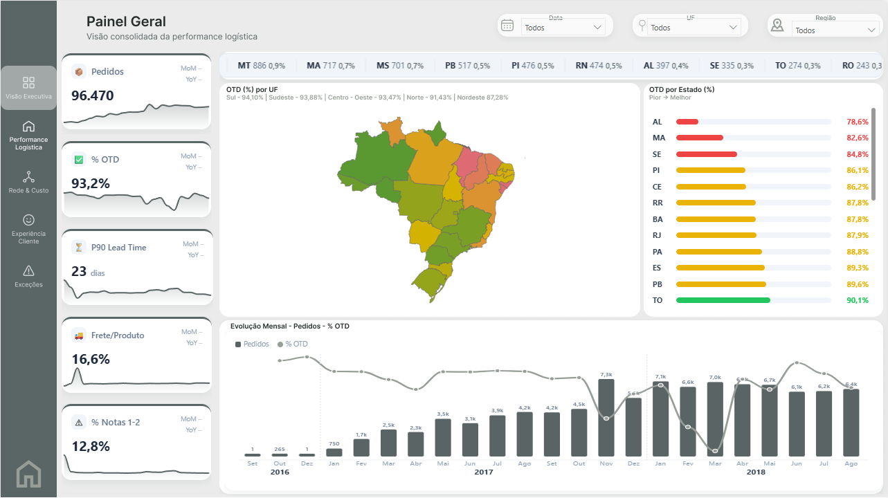
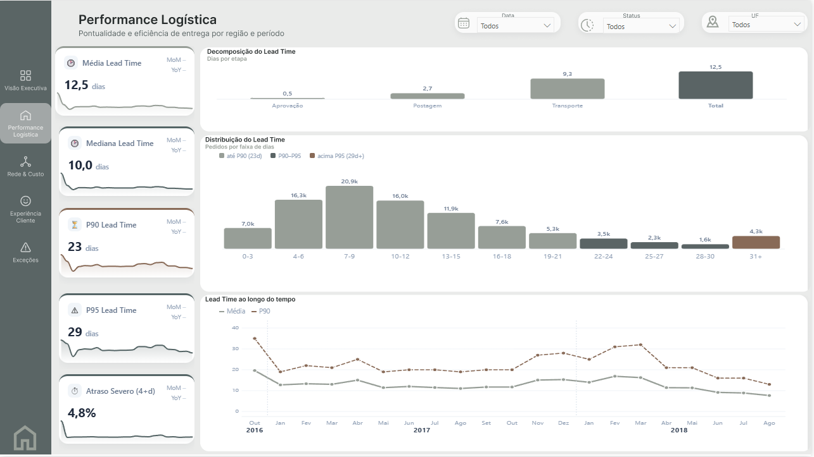
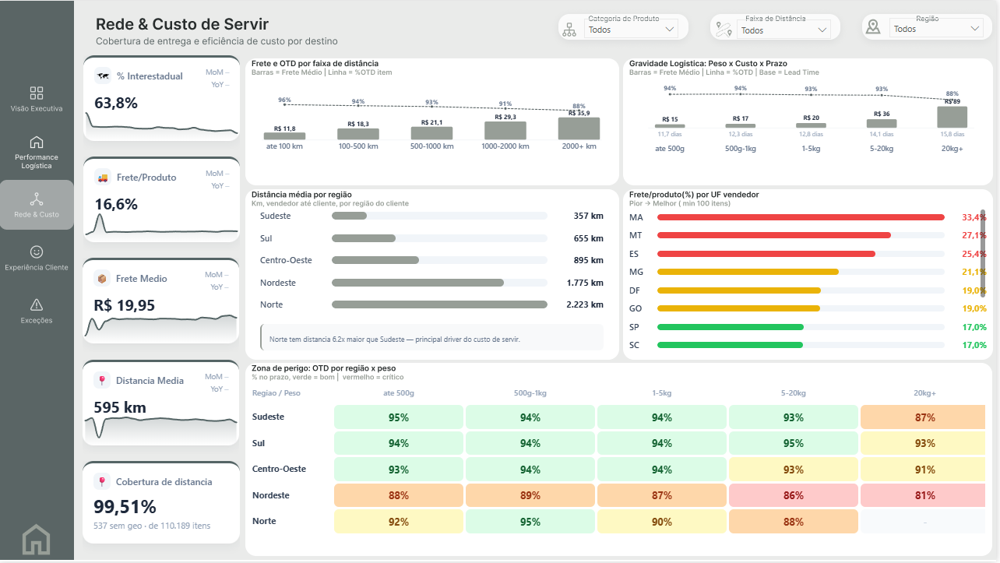
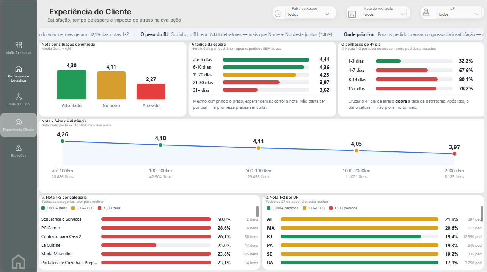
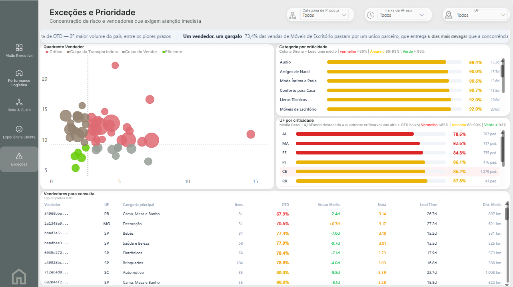

<h1 align="center">Olist Logistics Intelligence</h1>

<p align="center">
  <em>Pipeline analítico ponta a ponta sobre a operação logística e de e-commerce da Olist,<br>
  da ingestão de CSVs públicos ao dashboard executivo de alta fidelidade.</em>
</p>

<p align="center">
  
  
  
  
  
  
</p>

---

## Impacto e Insights de Negócio

Este projeto parte de uma premissa simples: dado sem decisão é custo. O foco não foi construir um dashboard bonito, mas responder perguntas que um Head de Operações realmente faz, com rigor suficiente para agir com confiança no resultado. Três achados se destacaram pela clareza e implicação direta de negócio:

**📉 Penhasco do 4º Dia**
A taxa de detratores salta de **33% para 70%** entre o 3º e o 4º dia de atraso — mais que dobra em 24 horas — e satura em ~82% depois disso. Não é uma curva suave; é um degrau. A implicação é cirúrgica: não é preciso zerar atrasos, é preciso garantir que nenhum cruze esse limiar.

**⏳ Fadiga da Espera**
Mesmo em pedidos entregues **rigorosamente no prazo**, a nota cai de forma contínua conforme a espera cresce: **4,44 → 3,62** (faixas de até 5 dias até 31+ dias). Nenhuma promessa foi quebrada. O que corrói a satisfação é a espera em si. A alavanca aqui não é cumprir o SLA; é encurtar a promessa em rotas onde ela é longa demais.

**🎯 Concentração do Dano**
Apenas **6,77% dos pedidos** (os que atrasam) concentram **32% de toda a insatisfação** da plataforma. A insatisfação não está espalhada; está represada numa fração pequena e endereçável. Consertar o conjunto certo protege ⅓ da reputação com fração do investimento.

**❌ Hipótese Rejeitada — "Síndrome do Frete Caro"**
Testamos se fretes absolutos altos geravam notas baixas. O efeito existiu, mas foi fraco, não monotônico e marginal (4,21 → 4,03). Foi documentado e descartado antes de entrar no painel. Analisar bem inclui saber o que não mostrar.

---

**Diferenciais técnicos que sustentam a confiabilidade dos números:**

- **Governança visível.** 695 incoerências cronológicas (0,72% da base) expostas como guardrail auditável no painel, verificado empiricamente que não contaminam os percentis P90/P95 do lead time.
- **Filtros de significância estatística.** Pisos amostrais aplicados em todos os rankings (mínimo 50 itens por seller, 100 por categoria, 300 por UF) para que nenhum número exibido seja ruído amostral disfarçado de insight.
- **Dois grãos, zero fan-out.** Tabelas fato de pedido e item mantidas separadas e reconciliadas via `TREATAS` no DAX, preservando a integridade matemática de cada métrica.
- **Engenharia geoespacial no banco.** Distância geodésica calculada via `geography::STDistance` (SRID 4326) direto no SQL Server, colocando o cálculo pesado onde ele é mais eficiente.

📖 **Documentação técnica aprofundada: [`LOGISTICS_DOCUMENTATION.md`](./LOGISTICS_DOCUMENTATION.md)**

---

## Fluxo do Pipeline ETL


### Sobre a Arquitetura Medalhão

A separação Bronze/Silver/Gold é um padrão que quis colocar em prática aqui. A lógica que me guiou foi simples: **ferramenta proporcional ao dado**. Cálculos geoespaciais pesados vivem no SQL Server, onde são naturalmente eficientes. Limpeza e tipagem vivem no Python, onde o controle é total. Agregações analíticas dependentes de contexto de filtro vivem no DAX, onde fazem sentido semântico. Essa disciplina evita o anti-padrão de empurrar toda a lógica para uma única camada.

---

## 🧩 Modelo de Dados

Modelo em **estrela**, com dois grãos deliberadamente mantidos separados:

- `gold.fato_entregas` — grão de pedido (96.470 linhas): prazo, OTD, lead time, nota
- `gold.fato_itens` — grão de item (110.189 linhas): frete, peso, categoria, distância
- `dCalendario` e `estados` — dimensões de contexto

O cruzamento entre grãos é feito via `TREATAS(VALUES(vw_fato_itens[id_pedido]), vw_fato_entregas[id_pedido])` dentro de `CALCULATE`, sem fan-out e sem colapso de grão. Detalhamento com código DAX e SQL na [documentação técnica](./LOGISTICS_DOCUMENTATION.md).

---

## O Dashboard — 5 Páginas

O painel segue uma progressão diagnóstica: de *o que aconteceu* até *o que fazer*. Cada página responde uma pergunta, entrega KPIs específicos e não repete métricas de outras páginas.

| # | Página | Pergunta respondida | KPIs centrais |
|---|---|---|---|
| 1 | **Visão Executiva** | O que está acontecendo? | OTD 91,9% · P90 23d · Notas 1-2 13,4% · Frete/Produto 16,6% |
| 2 | **Performance Logística** | Onde o tempo se perde? | Média 12,5d · Mediana 10d · P90 23d · P95 29d · Atraso severo 4,8% |
| 3 | **Rede & Custo de Servir** | Por quê custa mais longe? | Frete SP R$17 vs Norte ~R$46 · Distância média 595 km · Interestadual 63,8% |
| 4 | **Experiência do Cliente** | Quem sente o atraso? | Nota no prazo 4,11 · Nota atrasado 2,27 · Penhasco 4º dia · Fadiga da Espera |
| 5 | **Exceções & Prioridade** | O que fazer e por onde? | RJ: 12.350 pedidos · OTD 86,5% · 1 seller concentra 73,4% dos atrasos em Móveis |

---

### Página 1 — Visão Executiva



A página de entrada do painel foi desenhada para dar a resposta de 10 segundos: a operação está saudável? O visual central é um mapa choropleth do Brasil colorido por OTD, que permite identificar de imediato quais estados estão fora do padrão sem precisar ler uma linha de tabela. Um ranking lateral lista todos os 27 estados do pior ao melhor, e a evolução mensal combina volume de pedidos e taxa de pontualidade numa única série temporal, revelando se a melhora ou piora de OTD acompanha picos de demanda ou é estrutural.

**O que essa página responde:** onde estamos hoje, comparado a onde estávamos, e quais regiões precisam de atenção imediata.

---

### Página 2 — Performance Logística



Se a Visão Executiva diz *o que*, a Performance Logística explica *quanto*. O visual mais importante é a cascata de decomposição do lead time: dos 12,5 dias médios, 0,5 dias são consumidos na aprovação do pagamento, 2,7 dias na postagem e 9,3 dias no transporte em si. Esse corte é fundamental porque cada etapa tem um responsável diferente e, portanto, uma alavanca de melhoria diferente.

O histograma de distribuição usa três cores deliberadas: cinza para pedidos abaixo do P90 (operação normal), tom intermediário para a faixa P90-P95 (cauda de atenção) e marrom para acima do P95 — os 4,8% de pedidos com atraso severo. Essa separação visual evita que a média esconda o que acontece na cauda, que é exatamente onde o cliente sente mais.

**O que essa página responde:** onde o tempo se perde dentro do processo, qual é a real extensão da cauda de atraso e como o desempenho evoluiu.

---

### Página 3 — Rede & Custo de Servir



Esta página isola a causa estrutural do que as duas anteriores mostraram como sintoma. O gráfico de Frete e OTD por faixa de distância mostra que o frete sobe de R$11,8 (até 100 km) para R$35,9 (acima de 2.000 km), enquanto o OTD cai de 96% para 88%. O heatmap de Zona de Perigo (Região × Peso) mostra que o Nordeste com itens pesados é a combinação de maior risco, chegando a 81% de OTD na célula mais crítica.

**O que essa página responde:** por que certas regiões e categorias custam mais e chegam mais tarde, e onde a combinação de fatores cria zonas de perigo operacional.

---

### Página 4 — Experiência do Cliente



Aqui o projeto traduz operação em consequência humana. O Penhasco do 4º Dia é o achado mais acionável: a taxa de detratores vai de 32,2% (1-3 dias de atraso) para 67,6% (4-7 dias), mais que dobrando em uma única janela. A Fadiga da Espera é o achado contra-intuitivo: mesmo isolando pedidos no prazo, a nota cai de 4,44 para 3,62 conforme o lead time cresce.

**O que essa página responde:** o que o cliente sente, onde os limiares de tolerância estão e quais regiões concentram o maior volume de insatisfação.

---

### Página 5 — Exceções e Prioridade



A última página é onde o diagnóstico vira ação. O destaque resume o achado mais cirúrgico: 73,4% dos atrasos em Móveis de Escritório passam por um único vendedor. O Quadrante Vendedor posiciona cada seller pelo tempo de handling × tempo de trânsito, separando quatro perfis de culpa com tratamentos distintos. A tabela dos 50 piores vendedores fecha com informação suficiente para uma reunião de parceiros.

**O que essa página responde:** quem exige atenção imediata, qual é a causa em cada caso e por onde começar.

---

## 🤖 IA como Copiloto Técnico — MCP + Claude

Este projeto foi desenvolvido com **Claude (Anthropic) integrado ao Power BI Desktop via MCP (Model Context Protocol)** — uma abordagem que vai além do "usar IA para escrever código". O MCP permitiu conectar o assistente diretamente ao modelo semântico vivo, transformando a conversa em ação dentro do ambiente de trabalho real.

> A distinção importante: IA não foi usada como atalho para gerar conteúdo. Foi usada como **copiloto de engenharia** — para iterar mais rápido, depurar com mais precisão e documentar com mais consistência. Cada medida gerada foi validada contra os dados reais antes de entrar no painel.

### Como o MCP foi utilizado na prática

A integração com o Power BI via MCP possibilitou um ciclo de desenvolvimento substancialmente diferente do fluxo tradicional:

```
Conversa em linguagem natural
        ↓
Claude lê o modelo semântico vivo (tabelas, relacionamentos, medidas existentes)
        ↓
Gera DAX com naming convention do projeto, referenciando colunas reais
        ↓
Cria/atualiza medidas diretamente no modelo via MCP
        ↓
Executa query de smoke test: EVALUATE ROW("teste", [NomeDaMedida])
        ↓
Valida resultado contra dado esperado → ajusta se necessário
```

Esse ciclo substituiu o fluxo manual de: abrir editor DAX → escrever → publicar → verificar → corrigir → repetir.

### Exemplos concretos de uso

**Criação de medidas DAX com contexto do modelo**

Em vez de escrever DAX no vácuo, o Claude lia o schema real (`gold.fato_entregas`, `gold.fato_itens`, `dCalendario`) e gerava medidas já adaptadas ao naming convention do projeto (`vQuantidadeIncoerente`, `vTotalPedidos`) — uma disciplina necessária porque esta instância do Analysis Services rejeita nomes de variáveis curtos como `qtd` ou `total`.

```dax
-- Exemplo de medida gerada via MCP e validada no modelo real
Taxa OTD =
VAR vTotalPedidos = COUNTROWS(fato_entregas)
VAR vPedidosNoPrazo =
    CALCULATE(
        COUNTROWS(fato_entregas),
        fato_entregas[atraso_dias] <= 0
    )
RETURN
    DIVIDE(vPedidosNoPrazo, vTotalPedidos)
```

**Debugging direto no modelo**

Quando medidas falhavam silenciosamente, o comando `INFO.MEASURES()` via MCP listava todas as medidas com erro e suas mensagens — eliminando a necessidade de abrir cada medida manualmente para encontrar o problema.

**Patterns DAX complexos para visuais HTML**

Os visuais customizados em HTML (barras horizontais, cards com métricas, tabelas scrolláveis) exigem medidas DAX que constroem strings HTML dinamicamente. O pattern com `CROSSJOIN` + `ADDCOLUMNS` + `CONCATENATEX` para evitar o problema de `VAR` aninhado dentro de `CONCATENATEX` foi desenvolvido iterativamente via MCP — cada iteração testada com um smoke test antes de ser aplicada ao painel.

```dax
-- Pattern de HTML via DAX: pre-computa valores em gridCalc antes do CONCATENATEX
HTML Ranking UF =
VAR gridCalc =
    ADDCOLUMNS(
        CROSSJOIN(VALUES(estados[uf]), {""}),
        "vOTD", [Taxa OTD],
        "vPedidos", [Total Pedidos]
    )
VAR gridCells =
    ADDCOLUMNS(
        gridCalc,
        "vRow", "<div class='row'>..." & [vOTD] & "...</div>"
    )
RETURN
    CONCATENATEX(gridCells, [vRow], "")
```

**Relacionamentos e diagnóstico do modelo**

A cada abertura do Power BI Desktop (que recria a porta do Analysis Services), o MCP executava `ListLocalInstances` → `Connect` → `relationship_operations List` como checagem de saúde do modelo antes de qualquer edição.

### Documentação automática do modelo via Skill

Além do desenvolvimento, utilizei uma **skill customizada de documentação Power BI** que leu o modelo semântico e gerou automaticamente:

- Inventário de todas as tabelas com contagem de linhas, colunas e medidas
- Catálogo de medidas organizado por pasta de exibição, com expressão DAX completa
- Mapa de relacionamentos (cardinalidade, direção de filtro, tipo)
- Grafo de dependências entre medidas


> 📄 **A documentação completa gerada automaticamente está disponível em [`docs/Documentacao_PBI.html`](./docs/Documentacao_PBI.html)**

Gerar isso manualmente — para um modelo com 5 tabelas, ~80 medidas organizadas em 15 pastas e 6 relacionamentos — levaria horas e ficaria desatualizado na primeira alteração. Com a skill, o processo leva segundos e reflete sempre o estado atual do modelo.

### O que essa abordagem demonstra

Usar IA como copiloto técnico não é sobre delegar raciocínio — é sobre **amplificar capacidade de execução**. O julgamento analítico (quais insights são válidos, quais hipóteses rejeitar, como estruturar o modelo) permanece humano. O que a IA acelerou foi o ciclo de implementação: menos tempo entre "tenho uma ideia" e "está validado no dado real".

Para qualquer profissional de dados, saber orquestrar ferramentas de IA dentro do fluxo de trabalho já é uma competência diferencial — não porque substitui o conhecimento técnico, mas porque multiplica o que um profissional consegue entregar com o mesmo tempo.

---

## Principais Descobertas

### O "Penhasco do 4º Dia"

Existe um limiar psicológico de tolerância claro no consumidor. A taxa de detratores salta de 33,15% (atraso de 1 a 3 dias) para 70,65% (atraso de 4 a 7 dias), mais que dobrando em uma janela de 24 horas, e depois estabiliza em torno de 82%. Um atraso de 3 dias é recuperável; o 4º dia é reputacionalmente catastrófico.

### A "Fadiga da Espera"

Cumprir o SLA não é suficiente. Mesmo em pedidos entregues rigorosamente no prazo, a nota cai de forma monotônica conforme o lead time cresce: 4,44, 4,36, 4,27, 4,15, 3,97 e 3,62 (faixas de 0-5d até 31+d). O problema pode não ser o atraso; pode ser a promessa longa demais em si.

### Concentração do Dano

Apenas 6,77% dos pedidos, os que atrasam, concentram 32,08% de todas as notas 1-2 da plataforma. A insatisfação não está espalhada; está represada numa fração pequena e endereçável.

### Hipótese Rejeitada — "Síndrome do Frete Caro"

Testamos se fretes absolutos altos geravam avaliações ruins. O efeito existiu, mas foi fraco, não monotônico e marginal (4,21 para 4,03). O visual foi construído, avaliado e descartado do painel final. Analisar bem inclui saber o que não mostrar.

---

## Governança & Qualidade de Dados

A filosofia adotada aqui é simples: qualidade não se esconde, se expõe. Em vez de deletar silenciosamente os registros problemáticos, cada anomalia foi quantificada, isolada e transformada num artefato visual auditável dentro do próprio painel.

**Incoerências cronológicas (695 casos — 0,72% da base)**

| Tipo | Casos | Interpretação |
|---|---:|---|
| Postagem anterior à aprovação do pagamento | 675 | Defasagem de sincronização entre sistemas |
| Entrega anterior à postagem | 20 | Impossibilidade física — erro de timestamp |
| Aprovação anterior à data de compra | 14 | Desvio de relógio entre sistemas |

**Verificação empírica: os 695 contaminam os percentis?**

| Métrica | Base completa (96.470) | Sem os 695 incoerentes | Impacto |
|---|:---:|:---:|:---:|
| P90 lead time | **23 dias** | **23 dias** | zero |
| P95 lead time | **29 dias** | **29 dias** | zero |

**Pisos amostrais — blindagem estatística dos rankings**

| Contexto | Piso amostral | Justificativa |
|---|:---:|---|
| Sazonalidade mensal | ≥ 30 pedidos | Remove set/2016 e dez/2016 (1 pedido cada) |
| Ranking por UF | ≥ 300 pedidos | Estabiliza a proporção de detratores por estado |
| Ranking de sellers (OTD) | ≥ 50 itens | Impede que um vendedor com poucos itens marque 0% por acaso |
| Ranking de categorias | ≥ 100 itens | Reduz variância da taxa de atraso por categoria |

---

## 📁 Estrutura do Repositório

```
olist-logistics-intelligence/
├── CAPAS/
│   ├── ETL.png
│   ├── p1_visao_executiva.png
│   ├── p2_performance_logistica.png
│   ├── p3_rede_custo.png
│   ├── p4_experiencia_cliente.png
│   ├── p5_excecoes_prioridade.png
│   └── ai_pbi_documentation.png       # print da documentação gerada via skill
│
├── bronze/                             # Parquets Bronze (gerados pelo pipeline)
├── silver/                             # Parquets Silver (gerados pelo pipeline)
│
├── olist_pipeline_bronze_silver.py     # ETL: CSV → Bronze → Silver (Parquet)
├── olist_carga_silver_sqlserver.py     # Carga: Silver → tabelas silver.* no SQL Server
│
├── sql/
│   ├── olist_02_schema_sqlserver.sql   # DDL das tabelas silver.* e views gold.*
│   └── views/                         # vw_fato_entregas, vw_fato_itens
│
├── powerbi/
│   └── olist_logistics.pbix
│
├── docs/
│   ├── etl_flow.html                   # diagrama interativo do pipeline
│   └── Documentacao_PBI.html          # documentação automática do modelo Power BI
│
├── README.md
├── LOGISTICS_DOCUMENTATION.md
└── requirements.txt
```

---

## Limitações & Próximos Passos

- **Distância geodésica ≠ rodoviária.** `STDistance` mede linha reta, suficiente para provar a direção do efeito, mas subestima a distância real. Próximo passo: integrar matriz de distância viária.
- **Análise observacional.** A Fadiga da Espera pode conter confundidores — regiões remotas concentram lead times longos e peso alto ao mesmo tempo. Próximo passo: controle multivariado para isolar o efeito marginal de cada variável.
- **Recorte temporal fixo.** O dataset cobre setembro/2016 a agosto/2018; sazonalidades e comportamentos podem ter evoluído.

---

## Autor

**Vinicius Braga Bruno** — Data Analyst
[github.com/viniciusbbruno](https://github.com/viniciusbbruno) · Projeto de portfólio · Dataset público Olist (Kaggle)

<p align="center"><sub>Construído com rigor estatístico, obsessão por clareza e o princípio de que a ferramenta deve ser proporcional ao dado.</sub></p>
